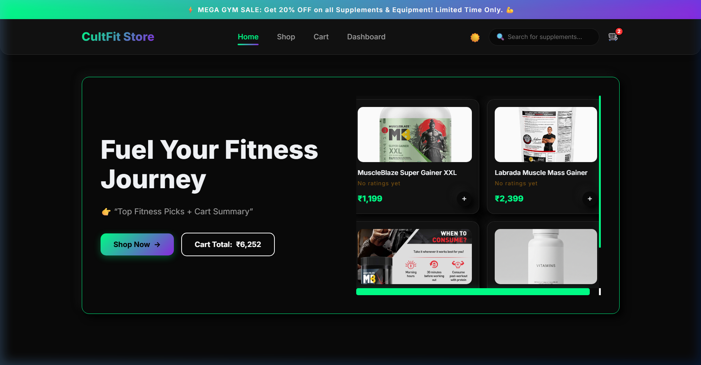
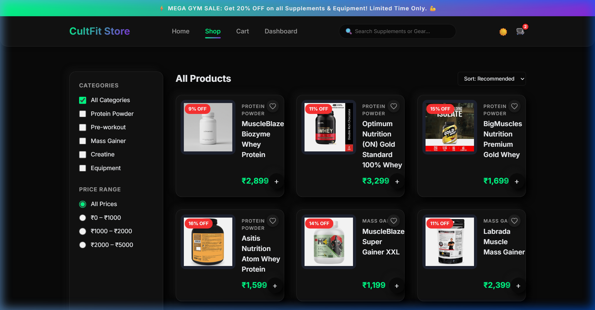
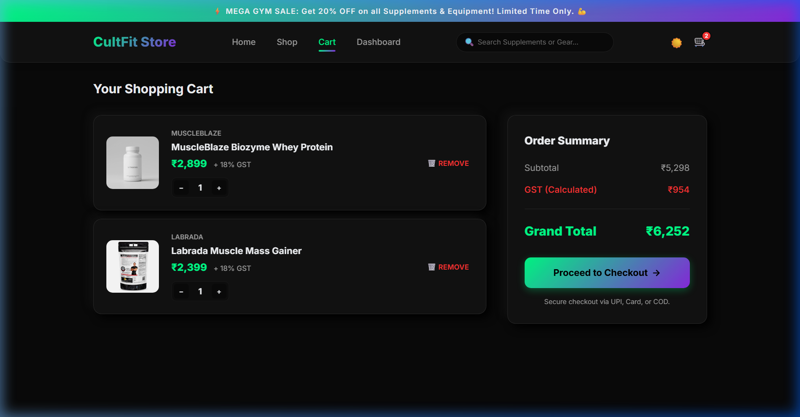

# CultFit Store

A production-ready fitness supplement and equipment e-commerce platform built with Node.js, Express, MySQL, and Vanilla JavaScript. 

**Live Demo:** Coming soon (deployment planned)

---

## Quick Start

```bash
# 1. Install dependencies
npm install

# 2. Setup MySQL database
mysql -u root -p -e "CREATE DATABASE ecommerce_db;"
mysql -u root -p ecommerce_db < database/schema.sql

# 3. Configure environment
cp .env.example backend/.env

# 4. Start the server
npm run dev
# The application will be available at http://localhost:5000
```

---

## Screenshots

### Home


### Products


### Cart


---

## Key Highlights

- **JWT Authentication:** Secure stateless session management for user login and registration.
- **Transaction-Safe Order Processing:** MySQL ACID transactions ensure inventory integrity during concurrent checkouts.
- **MVC Architecture:** Clean separation of concerns across models (SQL), views (HTML/CSS), and controllers (Express).
- **Joi Validation:** Strict request payload validation preventing malformed data and injection attacks.
- **Secure API Handling:** Centralized error handling, standardized response formatting, and environment-driven configuration.

---

## Architecture Notes

- Backend follows MVC architecture (routes, controllers, validators)
- MySQL transactions ensure atomic order processing and stock consistency
- API responses follow standardized `{ success, message, data }` format
- Stateless authentication using JWT
- Centralized error handling improves maintainability

---

## Tech Stack

| Layer | Technology |
|-------|-----------|
| **Backend** | Node.js, Express.js |
| **Database** | MySQL2 (Connection Pooling) |
| **Security** | JWT, bcryptjs, Helmet, CORS |
| **Validation** | Joi |
| **Frontend** | HTML5, CSS3, Vanilla JavaScript |

---

## Project Structure

```text
CultFit-Store/
├── backend/
│   ├── config/          # Database connection pooling
│   ├── controllers/     # Core business logic
│   ├── middlewares/     # JWT authentication and Joi validation
│   ├── routes/          # API endpoint definitions
│   ├── validators/      # Schema definitions
│   └── server.js        # Application entry point
├── frontend/
│   ├── css/             # Styling and layout
│   ├── js/              # API client and UI logic
│   ├── images/          # Static assets
│   └── *.html           # Client-side views
├── database/
│   ├── schema.sql       # DDL, views, and triggers
│   └── seed.sql         # Initial mock data
└── docs/                # Project documentation and screenshots
```

---

## API Overview

All endpoints follow a standardized `{ success, message, data }` response format.

| Endpoint | Method | Description |
|----------|--------|-------------|
| `/api/health` | GET | System health check |
| `/api/auth/register` | POST | User registration |
| `/api/auth/login` | POST | User authentication |
| `/api/products` | GET | Product retrieval with query filters |
| `/api/cart` | GET/POST | Cart state management |
| `/api/orders` | POST | Order placement and transaction processing |
| `/api/wishlist` | GET/POST/DELETE | Wishlist management |
| `/api/coupons/validate` | POST | Promotional code validation |

---

## Mock Payment Guide

This project implements a mock payment gateway for demonstration purposes.

- **Cash on Delivery:** Transactions always succeed.
- **Card Payment (Success):** Any generic 16-digit number.
- **Card Payment (Failure):** Entering `1111` simulates a declined transaction.

---

## Notes

- This project is designed for educational and portfolio demonstration purposes.
- The Node.js backend serves the frontend static files directly.
- Financial transactions are fully simulated.

---

## License

MIT
